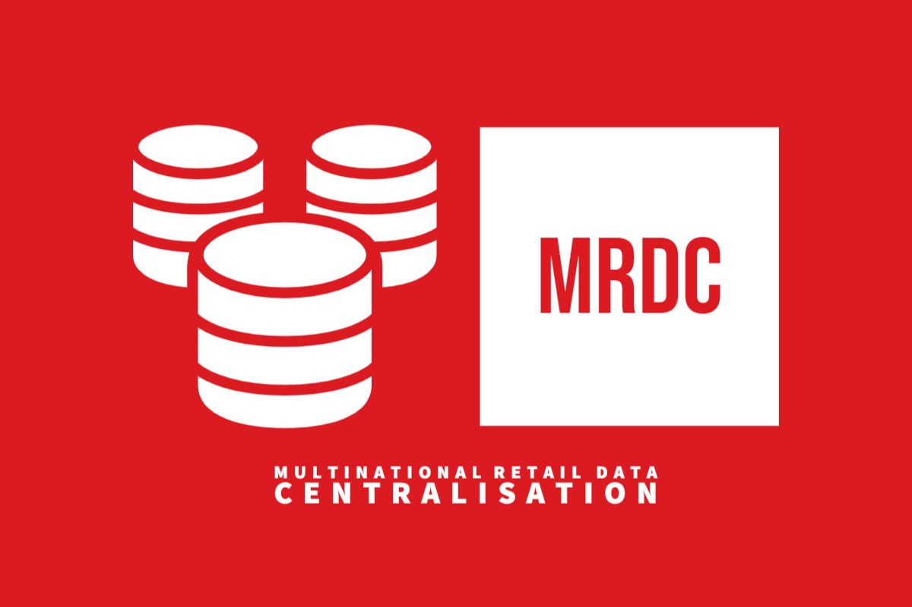

<!-- README file in MD for the Multination Retail Data Centre repository-->
<a name="readme-top"></a>
<!--
*** Attribution and thanks: README template adapted from Othneil Drew's example, available at:
*** https://github.com/othneildrew/Best-README-Template
-->


<!-- PROJECT LOGO -->
<p align="center">
  
  <br>
  Extract, process and unify data from multiple sources in a single PostgreSQL database.
</p>


<!-- SHIELDS FOR REPO -->
<p align="center">
    <a>
        </a>
    <a>
        </a>
</p>


<!-- TABLE OF CONTENTS -->
<details>
  <summary>Table of Contents</summary>
  <ol>
    <li>
      <a href="#about-the-project">About The Project</a>
    </li>
    <li>
      <a href="#installation">Installation</a>
      <ul>
        <li><a href="#clone-repo">Step 1: Clone the Repository</a></li>
        <li><a href="#setup-env">Step 2: Setup the Environment</a></li>
      </ul>
    </li>
    <li>
      <a href="#usage">Usage</a>
        <ul>
          <li><a href="#credentials">Credentials</a></li>
          <li><a href="#executing-the-data-centralisation">Executing the data centralisation</a></li>
        </ul>
    </li>
    <li>
      <a href="#file-structure">File Structure</a>
    </li>
    <li><a href="#license">License</a></li>
  </ol>
</details>


<!-- ABOUT THE PROJECT -->
## About the Project

### Summary
This project centralises data by extracting and cleaning data from multiple sources and uploading them into a central PostgreSQL database.

- `Key platforms`: PostgreSQL, AWS (S3 Buckets, Amazon RDS), REST API
- `Other file types`: Structured (.json, .csv), Unstructured (.pdf)
- `Languages and libraries`: Python (Pandas, Boto3)

### Utilities
There are three main utility class modules, which can be found under the `/src/` folder:

- **database_utils.py**: Utility class to connect and upload data to a database.
- **data_extraction.py**: Utility class to extract data from multiple sources, including: REST APIs, S3 buckets, structured and unstructured data files (e.g. .csv, .json, .pdf)
- **data_cleaning.py**: Utility class to clean data from specific data sources.

The main application logic is then defined in:
- **main.py**: Main script containing the application logic. It extracts and cleans data from multiple sources and uploads them to a local database (i.e. PostgreSQL).

<!-- Installation -->
## Installation

<a name="clone-repo"></a>

### Step 1: Clone the repository

For this step, we recommend cloning the repository using `Git`. If you do not have Git installed in your machine, check the resources [here][url-installing-git].

1. Open a command prompt.
2. Change the current working directory to the location where you want the cloned directory.
3. Type git clone, and then paste the URL for the Github repository.
    ```sh
    git clone https://github.com/pili-zhangqiu/multinational-retail-data-centralisation.git
    ```

<a name="setup-env"></a>

### Step 2: Setup the environment

This project only uses Python in-built modules, and as such you will not need to install any third-party libraries.

To set up the virtual environment, just run the `setup_venv.py` file. This will initialise a virtual environment with all the necessary libraries listed in the `requirements.txt`.

TODO: Add setup_venv.py

If you don't have Python, you can find more information on how to install it [here][url-installing-python].

<a href="https://wiki.python.org/moin/BeginnersGuide/Download" rel="Python Installation Guide">
  
</a>


<p align="right">(<a href="#readme-top">back to top</a>)</p>


<!-- USAGE -->
## Usage

### Credentials
To run this project, you will have to set up the following credentials and databases:

<details close>
<summary><b>PostgreSQL</b></summary>
TODO: Add info
</details>

<br>

<details close>
<summary><b>AWS</b></summary>
TODO: Add info
</details>

### Executing the data centralisation

If you followed the previous steps on installation, you should be able to run the `main.py` script to start the data centralisation process. This will intialise the data extraction and cleaning processes, after which the processed data will be uploaded in a central PostgreSQL database.

To run the script, follow the next steps:

1. Open a command prompt. 
3. Navigate to the directory where the example script is located. 
4. Use the python method to run the example script.
    ```sh
    python main.py
    ```

<p align="right">(<a href="#readme-top">back to top</a>)</p>


<!-- FILE STRUCTURE -->
## File Structure

The repository structure is as follows:
```sh
multinational-retail-data-centralisation/
├── src/
│   ├── database_utils.py
│   ├── data_extraction.py
│   └── data_cleaning.py
├── main.py
├── img/
│   └── logo.jpeg
├── LICENSE.txt
├── README.md
└── .gitignore
```

<p align="right">(<a href="#readme-top">back to top</a>)</p>

<!-- LICENSE -->
## License

Distributed under the Apache 2.0 License. See `LICENSE.txt` for more information.

<p align="right">(<a href="#readme-top">back to top</a>)</p>


<!-- MARKDOWN LINKS & IMAGES -->
<!-- https://www.markdownguide.org/basic-syntax/#reference-style-links -->
[url-installing-git]: https://git-scm.com/book/en/v2/Getting-Started-Installing-Git
[url-installing-python]: https://wiki.python.org/moin/BeginnersGuide/Download
