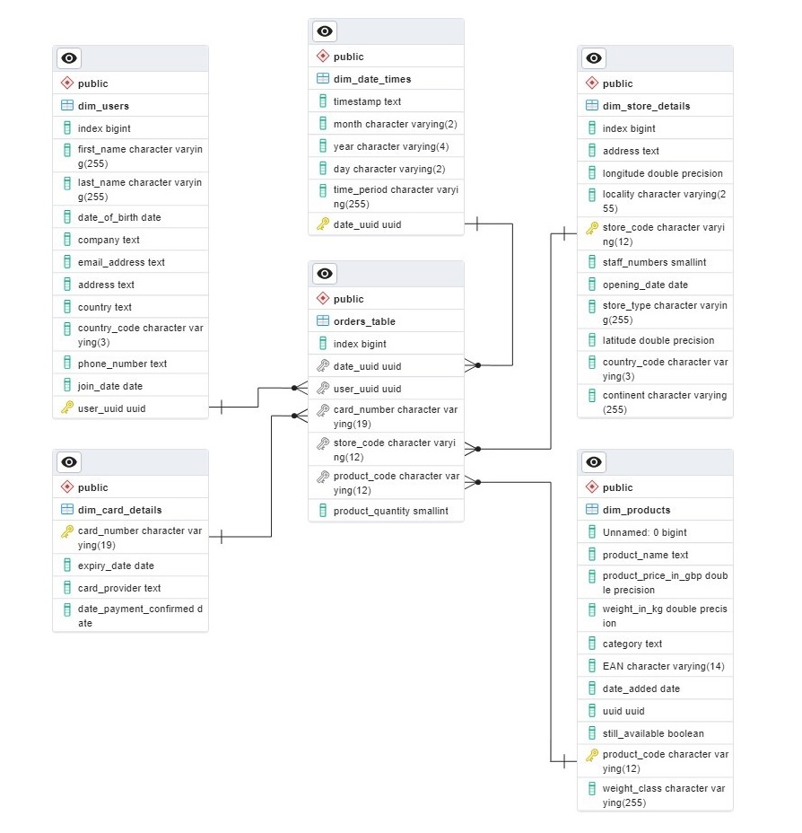

<!-- README file in MD for the Multination Retail Data Centre repository-->
<a name="readme-top"></a>
<!--
*** Attribution and thanks: README template adapted from Othneil Drew's example, available at:
*** https://github.com/othneildrew/Best-README-Template
-->


<!-- PROJECT LOGO -->
<p align="center">
  
  <br>
  Extract, process and unify data from multiple sources in a single PostgreSQL database.
</p>


<!-- SHIELDS FOR REPO -->
<p align="center">
    <a>
        </a>
    <a>
        </a>
</p>


<!-- TABLE OF CONTENTS -->
<details>
  <summary>Table of Contents</summary>
  <ol>
    <li>
      <a href="#about-the-project">About The Project</a>
    </li>
    <li>
      <a href="#installation">Installation</a>
      <ul>
        <li><a href="#clone-repo">Step 1: Clone the Repository</a></li>
        <li><a href="#setup-env">Step 2: Setup the Environment</a></li>
      </ul>
    </li>
    <li>
      <a href="#usage">Usage</a>
        <ul>
          <li><a href="#credentials">Credentials</a></li>
          <li><a href="#executing-the-data-centralisation">Executing the data centralisation</a></li>
        </ul>
    </li>
    <li>
      <a href="#file-structure">File Structure</a>
    </li>
    <li><a href="#license">License</a></li>
  </ol>
</details>


<!-- ABOUT THE PROJECT -->
## About the Project

### Summary
This project centralises data by extracting and cleaning data from multiple sources and uploading them into a central PostgreSQL database.

- **`Key platforms and technologies`**: PostgreSQL, AWS (S3 Buckets, Amazon RDS), REST API
- **`Files parsed`**: Structured (JSON, CSV), Unstructured (PDF)
- **`Languages and libraries`**: Python (Pandas, Numpy, Boto3, SQLAlchemy)

<p align="right">(<a href="#readme-top">back to top</a>)</p>

<!-- DATABASE SCHEMA -->
## Database Schema

### Table origins
Each table was extracted from a difference source. Procedures followed to extract the data include:

- Retrieving data from **AWS RDS databases**
- Retrieving data through **REST API** requests
- Downloading files from an **AWS S3 buckets**
- Parsing:
    - Unstructured (**PDF**) files
    - Structured or Semi-Structured (**CSV** and **JSON**) files

### Entity-Relationship Diagram (ERD)
The database follows a **``star schema``** design, with ***orders_table*** as its central or fact table. 

A total of 5 dimension tables are then linked to the fact table through primary and foreign key relationships, as specified below.

<p align="center">
  
</p>

<p align="right">(<a href="#readme-top">back to top</a>)</p>

<!-- Project Flow -->
## Project Flow

### 1. Data Extraction, Cleaning & Database Initialisation
The first step is to extract and clean the data originating from multiple sources and create a single, unified database containing this information.

To achieve this, three main utility class modules were created:

- **database_utils.py**: Utility class to connect and upload data to a database.
- **data_extraction.py**: Utility class to extract data from multiple sources, including: REST APIs, S3 buckets, structured and unstructured data files (e.g. .csv, .json, .pdf)
- **data_cleaning.py**: Utility class to clean data from specific data sources.

The main application logic to extract, clean and upload data to the central database is then defined in:
- **main.py**: Main script containing the application logic. It extracts and cleans data from multiple sources and uploads them to a local database (i.e. PostgreSQL).

### 2. Database Schema Design
Now that the database has been created, the next step is to define the relationship between the database tables.

Before defining the relationship between tables, all columns in the tables were **casted to their correct data types**. Information on the casting can be found in the casting ***.sql*** files inside the ``sql_schema/`` folder.

To connect the fact table with the dimension tables, primary and foreign keys were defined, as shown in the ***primary_keys.sql*** and ***foreign_keys.sql*** files in the ``sql_schema/`` folder.

### 3. Querying Data & Analysis
Queries were performed to analyse and answer key questions on business performance.
All the queries can be found in the ``sql_analysis/`` folder.

You can find the answers to some key questions below:

#### [(A) How many stores does the business have in each country?](./sql_analysis/stores_per_country.sql)

| country | number_of_stores |
|---------|------------------|
| GB      | 266              |
| DE      | 141              |
| US      | 32               |

#### [(B) Which locations have the most stores?](./sql_analysis/stores_per_locality.sql)

| locality     	| total_no_stores 	|
|--------------	|-----------------	|
| Chapletown   	| 14              	|
| Belper       	| 13              	|
| Bushey       	| 12              	|
| Exeter       	| 11              	|
| Arbroath     	| 10              	|
| High Wycombe 	| 10              	|
| Rutherglen   	| 10              	|

#### [(C) Which months produced the largest amounts of sales?](./sql_analysis/sales_per_month.sql)

| total_sales | month |
|-------------|-------|
| 669827.29   | 8     |
| 664560.19   | 1     |
| 653897.52   | 10    |
| 647025.12   | 5     |
| 642987.86   | 7     |
| 642189.12   | 3     |

#### [(D) How many sales are made online?](./sql_analysis/sales_online.sql)

| numbers_of_sales 	| product_quantities 	| location 	|
|------------------	|--------------------	|----------	|
| 26494            	| 105981             	| Web      	|
| 91202            	| 366106             	| Offline  	|

#### [(E) Which percentage sales comes from each store type?](./sql_analysis/sales_per_store_type.sql)

| store_type  | total_sales | percentage_total(%) |
|-------------|-------------|---------------------|
| Local       | 3397481.64  | 44.36               |
| Web Portal  | 1718046.71  | 22.43               |
| Super Store | 1218631.59  | 15.91               |
| Mall Kiosk  | 695367.25   | 9.08                |
| Outlet      | 629175.05   | 8.22                |

#### [(F) Which month in which year produced the highest sales?](./sql_analysis/sales_per_month_year.sql)

|total_sales|year|month|
|-----------|----|-----|
|27883.39   |1994|3    |
|27166.77   |2019|1    |
|27029.08   |2009|8    |
|26628.90   |1997|11   |
|26310.97   |2018|12   |
|26174.55   |2017|9    |
|26150.51   |2019|8    |
|25790.12   |2010|5    |
|25594.29   |2000|1    |
|25513.78   |1996|8    |

#### [(G) What is our staff headcount?](./sql_analysis/staff_count_per_country.sql)

|total_staff_numbers|country_code|
|-------------------|------------|
|13132              |GB          |
|6054               |DE          |
|1245               |US          |

#### [(H) Which German store type is selling the most?](./sql_analysis/sales_per_store_type_germany.sql)

|total_sales|store_type|country_code|
|-----------|----------|------------|
|1103848.76 |Local     |DE          |
|382822.64  |Super Store|DE          |
|246432.01  |Mall Kiosk|DE          |
|197393.70  |Outlet    |DE          |

#### [(I) How quickly is the company making sales?](./sql_analysis/time_between_sales_per_year.sql)

|year    |avg_time_between_sales|
|--------|----------------------|
|1998    |{"hours":2,"minutes":8,"seconds":6,"milliseconds":538.161}|
|2003    |{"hours":2,"minutes":8,"seconds":36,"milliseconds":218.084}|
|2017    |{"hours":2,"minutes":8,"seconds":39,"milliseconds":348.444}|
|2005    |{"hours":2,"minutes":9,"milliseconds":174.073}|
|1992    |{"hours":2,"minutes":9,"seconds":32,"milliseconds":62.921}|
|2015    |{"hours":2,"minutes":9,"seconds":36,"milliseconds":903.552}|
|1997    |{"hours":2,"minutes":9,"seconds":46,"milliseconds":934.207}|
|2014    |{"hours":2,"minutes":10,"seconds":5,"milliseconds":558.445}|
|2006    |{"hours":2,"minutes":10,"seconds":15,"milliseconds":623.512}|
|2004    |{"hours":2,"minutes":10,"seconds":29,"milliseconds":774.281}|
|2001    |{"hours":2,"minutes":10,"seconds":34,"milliseconds":39.781}|
|2018    |{"hours":2,"minutes":10,"seconds":37,"milliseconds":13.92}|
|1994    |{"hours":2,"minutes":10,"seconds":38,"milliseconds":998.756}|
|2019    |{"hours":2,"minutes":10,"seconds":40,"milliseconds":488.303}|
|2000    |{"hours":2,"minutes":10,"seconds":55,"milliseconds":241.739}|
|1996    |{"hours":2,"minutes":11,"milliseconds":84.763}|
|1999    |{"hours":2,"minutes":11,"seconds":5,"milliseconds":102.046}|
|2010    |{"hours":2,"minutes":11,"seconds":7,"milliseconds":808.24}|
|2007    |{"hours":2,"minutes":11,"seconds":8,"milliseconds":918.642}|
|2009    |{"hours":2,"minutes":11,"seconds":18,"milliseconds":622.594}|
|2021    |{"hours":2,"minutes":11,"seconds":44,"milliseconds":547.326}|
|2012    |{"hours":2,"minutes":11,"seconds":47,"milliseconds":533.684}|
|2020    |{"hours":2,"minutes":11,"seconds":58,"milliseconds":890.476}|
|2011    |{"hours":2,"minutes":12,"seconds":19,"milliseconds":240.745}|
|2016    |{"hours":2,"minutes":12,"seconds":50,"milliseconds":458.354}|
|1995    |{"hours":2,"minutes":13,"milliseconds":53.404}|
|2022    |{"hours":2,"minutes":13,"seconds":2,"milliseconds":3.698}|
|2008    |{"hours":2,"minutes":13,"seconds":3,"milliseconds":770.202}|
|2002    |{"hours":2,"minutes":13,"seconds":39,"milliseconds":915.69}|
|1993    |{"hours":2,"minutes":15,"seconds":35,"milliseconds":481.806}|
|2013    |{"hours":2,"minutes":17,"seconds":13,"milliseconds":712.533}|

<p align="right">(<a href="#readme-top">back to top</a>)</p>

<!-- Installation -->
## Installation

<a name="clone-repo"></a>

### Step 1: Clone the repository

For this step, we recommend cloning the repository using `Git`. If you do not have Git installed in your machine, check the resources [here][url-installing-git].

1. Open a command prompt.
2. Change the current working directory to the location where you want the cloned directory.
3. Type git clone, and then paste the URL for the Github repository.
    ```sh
    git clone https://github.com/pili-zhangqiu/multinational-retail-data-centralisation.git
    ```

<a name="setup-env"></a>

### Step 2: Setup the environment

This project only uses Python in-built modules, and as such you will not need to install any third-party libraries.

To set up the virtual environment, just run the `setup_venv.py` file. This will initialise a virtual environment with all the necessary libraries listed in the `requirements.txt`.

TODO: Add setup_venv.py

If you don't have Python, you can find more information on how to install it [here][url-installing-python].

<a href="https://wiki.python.org/moin/BeginnersGuide/Download" rel="Python Installation Guide">
  
</a>


<p align="right">(<a href="#readme-top">back to top</a>)</p>


<!-- USAGE -->
## Usage

### Credentials
To run this project, you will have to set up the following credentials and databases:

- [**PostgreSQL**](https://www.postgresql.org/) - Store your credentials in a file called:
  - **db_creds_local.yaml**
- [AWS](https://aws.amazon.com/?nc2=h_lg) - Store your credentials in files called:
  - **db_creds_aws_sso.yaml**
  - **db_creds_aws_api.yaml**
  - **db_creds_aws_rds.yaml**

### Executing the data centralisation

If you followed the previous steps on installation, you should be able to run the `main.py` script to start the data centralisation process. This will intialise the data extraction and cleaning processes, after which the processed data will be uploaded in a central PostgreSQL database.

To run the script, follow the next steps:

1. Open a command prompt. 
3. Navigate to the directory where the main.py script is located. 
4. Use the python method to run the example script.
    ```sh
    python main.py
    ```

<p align="right">(<a href="#readme-top">back to top</a>)</p>


<!-- FILE STRUCTURE -->
## File Structure

The repository structure is as follows:
```md
multinational-retail-data-centralisation/
├── main.py
│   Run this script to create a local database from the extracted data.
│
├── database_utils.py
│   Utility class to interact with databases.
├── data_extraction.py
│   Utility class to extract data from databases, API calls or files.
├── data_cleaning.py
│   Utility class to clean dataframes.
├── validation_utils.yaml
│
├── sql_schema/
│   Contains .sql files to cast columns and create relationships between tables.
│   ├── cast_dim_card_details_table.sql
│   ├── cast_dim_date_times_table.sql
│   ├── cast_dim_products_table.sql
│   ├── cast_dim_store_details_table.sql
│   ├── cast_dim_users_table.sql
│   ├── cast_orders_table.sql
│   ├── primary_keys.sql
│   └── foreigh_keys.sql
│
├── sql_analysis/
│   Contains .sql files to perform data analysis.
│   ├── sales_online.sql
│   ├── sales_per_month.sql
│   ├── sales_per_month_year.sql
│   ├── sales_per_store_type.sql
│   ├── sales_per_store_type_germany.sql
│   ├── staff_count_per_country.sql
│   ├── stores_per_country.sql
│   ├── stores_per_locality.sql
│   └── time_between_sales_per_year.sql
│
├── img/
│   └── (...)
├── README.md
├── LICENSE.txt
└── .gitignore
```

<p align="right">(<a href="#readme-top">back to top</a>)</p>

<!-- LICENSE -->
## License

Distributed under the Apache 2.0 License. See `LICENSE.txt` for more information.

<p align="right">(<a href="#readme-top">back to top</a>)</p>


<!-- MARKDOWN LINKS & IMAGES -->
<!-- https://www.markdownguide.org/basic-syntax/#reference-style-links -->
[url-installing-git]: https://git-scm.com/book/en/v2/Getting-Started-Installing-Git
[url-installing-python]: https://wiki.python.org/moin/BeginnersGuide/Download
